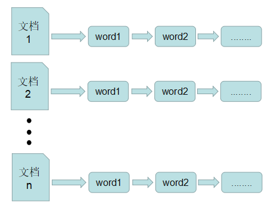
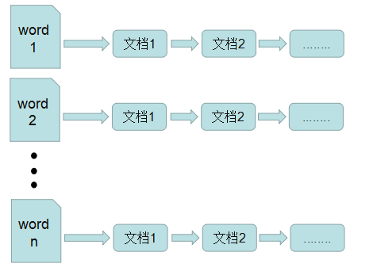

# 浅谈postgresql的GIN索引(通用倒排索引)
## 1 倒排索引原理
倒排索引来源于搜索引擎的技术，可以说是搜索引擎的基石。正是有了倒排索引技术，搜索引擎才能有效率的进行数据库查找、删除等操作。在详细说明倒排索引之前，我们说一下与之相关的正排索引并与之比较。

### 1.1 正排索引
在搜索引擎中，正排表是以文档的ID为关键字，表中记录文档中每个字的位置信息，查找时扫描表中每个文档中字的信息直到找出所有包含查询关键字的文档。
正排表结构如图1所示，这种组织方法在建立索引的时候结构比较简单，建立比较方便且易于维护;因为索引是基于文档建立的，若是有新的文档加入，直接为该文档建立一个新的索引块，挂接在原来索引文件的后面。若是有文档删除，则直接找到该文档号文档对应的索引信息，将其直接删除。但是在查询的时候需对所有的文档进行扫描以确保没有遗漏，这样就使得检索时间大大延长，检索效率低下。
尽管正排表的工作原理非常的简单，但是由于其检索效率太低，除非在特定情况下，否则实用性价值不大。



### 1.2 倒排索引
倒排表以字或词为关键字进行索引，表中关键字所对应的记录表项记录了出现这个字或词的所有文档，一个表项就是一个字表段，它记录该文档的ID和字符在该文档中出现的位置情况。
由于每个字或词对应的文档数量在动态变化，所以倒排表的建立和维护都较为复杂，但是在查询的时候由于可以一次得到查询关键字所对应的所有文档，所以效率高于正排表。在全文检索中，检索的快速响应是一个最为关键的性能，而索引建立由于在后台进行，尽管效率相对低一些，但不会影响整个搜索引擎的效率。
倒排表的结构图如下图


## 2 postgresql中的倒排索引

### 2.1 概述

GIN(Generalized Inverted Index, 通用倒排索引)是一个存储对(key, posting list)集合的索引结构，其中key是一个键值，而posting list 是一组出现过key的位置。如(‘hello’, ’14:2 23:4’)中，表示hello在14:2和23:4这两个位置出现过，在PG中这些位置实际上就是元组的tid。

在表中的每一个属性，在建立索引时，都可能会被解析为多个键值，所以同一个元组的tid可能会出现在多个key的posting list中。

通过这种索引结构可以快速的查找到包含指定关键字的元组，因此GIN索引特别适用于支持全文搜索，而PG的GIN索引模块也就是为了支持全文搜索而开发的。

### 2.2 扩展性

GIN索引具有很好的可扩展性，允许在开发自定义数据类型时由该数据类型的领域专家（而非数据库专家）设计适当的访问方法，这些访问方法只需考虑对于数据类型本身的语义处理，GIN索引自身可以处理并发控制、日志记录、搜索树结构等操作。

定义一个GIN访问方法所要做的就是实现3个用户定义的方法，这些方法定义了键值、键值与键值之间的关系、被索引值、能够使用索引的查询以及部分匹配。这些方法是:

```
int compare(Datum a, Datum b);
```
比较两个键（不是被索引项）并且返回一个整数，整数可以是小于零、零、大于零， 分别表示第一个键小于、等于、大于第二个键。空值键不会被传递给这个函数。

```
Datum *extractValue(Datum itemValue, int32 *nkeys, bool **nullFlags);
```
根据参数inputValue生成一个键值数组，并返回其指针，键值数组中元素的个数存放在另一个参数nkeys中。

```
Datum *extractQuery(Datum query, int32 *nkeys, StrategyNumber n, bool **pmatch, Pointer **extra_data, bool **nullFlags, int32 *searchMode)
```
根据参数query生成一个用于查询的键值数组，并返回其指针。

extractQuery通过参数n指定的操作符策略号来决定query的数据类型以及需要提取的键值，返回键值数组的长度存放在nkeys参数中。如果query中不包含键值，则nkeys可以为0或者-1：nkeys = 0 表示索引中所有值都满足查询，将执行完全索引扫描(查询null时是这样); nkeys = -1 表示索引中没有键值满足查询，跳过索引扫描。


