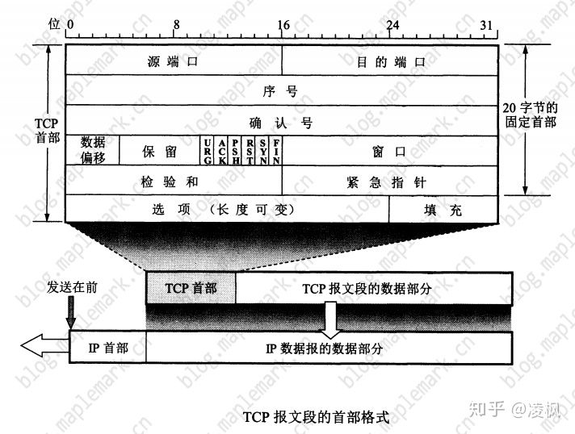

# TCP 协议

## 优点

- TCP 是面向连接的运输层协议. 应用程序在使用 TCP协议 之前必须建立 TCP 连接. 在传送数据完毕后, 必须释放已经建立的 TCP 连接
- 每一条 TCP 连接只能由两个端点, 只能是 点对点 的
- TCP 提供 可靠交付 的服务, 通过 TCP 连接传送的数据, 无差错, 不丢失, 不重复且按顺序到达
- TCP 提供 全双工通信 . TCP 允许通信双方的应用进程在任何时候都能发送数据. TCP 连接的两端设有发送缓存和接受缓存, 用来临时存放双向通信数据
- TCP 面向字节流.

### 面向字节流

虽然应用程序和 TCP 的交互是一次一个数据块(大小不等), 但 TCP 把应用程序交下来的数据仅仅看成一连串的 无结构字节流. 
TCP 并不知道所传送的字节流含义(当然也不关心)

## TCP 连接

TCP 把 连接 作为最基本的抽象. TCP 的许多特性都与 TCP 是面向连接的这个基本特性有关.

TCP 连接的端点叫做 套接字(socket)或插口, 根据 RFC793 的定义: 端口号拼接到 IP 地址即构成了 套接字
> 套接字 socket = (IP:PORT)

每一条 TCP 连接就是由协议软件所提供的一种抽象. TCP 连接的端口是个很抽象的套接字. 同一个 IP 地址可以由多个不同的 TCP 连接, 
而同一个端口号也可以出现在多个不同的 TCP 连接中

## 易混淆的 socket 
同一个名词 socket 却可表示多种不同的意思, 一下 socket 的意思跟本文中所引用的 RFC793 定义的 socket(指端口号拼接到IP地址)不同 

- 允许应用程序访问联网协议的 应用编程接口 API(Application Programing Interface), 即运输层和应用层之间的接口, 称为 socket API, 并简称 socket

## 可靠传输协议(reliable data transfer protocol)的工作原理

### 理想传输条件
特点:
- 传输信道不产生差错
- 不管发送方以多块的速度发送数据, 接收方总是来得及处理接收到的数据

实际的网络不具备以上两个理想条件. 需要使用一些可靠的传输协议, 当出现差错是让发送方重传出现差错的数据, 同时在接收方来不及处理接收到的数据时,
及时告诉发送发适当减低发送数据的速度. 这样, 不可靠的传输信道就能实现可靠传输了.

把传送的数据单元都称为分组.

全双工通信的双方既是发送方也是接收方, 以下协议中我们仅考虑 单向数据传输的情况, 但也要注意我们的协议需要在发送方和接收方两个方向上传输分组.

### 1. 完全可靠信道上的可靠传输协议 (rdt1.0)
首先, 我们考虑最简单情况, 即底层信道是完全可靠的. 我们称该协议为 rdt1.0, 下图反应了 rdt1.0 发送方和接收方的有限状态机(finite-state machine, FSM)

rdt1.0 发送方只存在一个状态:
- rdt 发送方等待`rdt_send(data)`事件发生, 通过 `rdt_send(data)` 接收高层数据, 经由 `make_pkt(data)` 和 `udt_send(data)` 发送分组到信道中, 然后回到等待 `rdt_send(data)` 状态.

rdt1.0 接收方只存在一个状态:
- rdt 接收方等待`rdt_rcv(pkt)`事件发生, 通过 `rdt_rcv(pkt)` 从底层接收数据, 经由 `extract(pkt, data)` 和 `deliver_data(data)` 将数据上传给高层, 然后回到等待 `rdt_rcv(pkt)` 状态.

> 注意, 我们假定了接收方接收数据的速率和发送方发送数据的速率一样快.

### 2. 具有比特差错信道上的可靠传输协议 (rdt2.0)
我们假定, 信道中的分组是有可能受损的(即出现比特差错),但所有分组将按其发送顺序被接收.

#### 自动重传请求协议(Autimatic Repeat reQuest, ARQ)
对于使用 肯定确认(positive acknowledgment) 和 否定确认(negative acknowledgment) 使得接收方可以让发送方知道哪些内容被正确接收,
哪些内容接收有误需要重传的协议.

一般来说 ARQ 需要三种协议来处理存在的比特差错:
- 差错检测, 需要额外比特从发送方发送到接收方;
- 接收方反馈, rdt2.0 协议将从接收方向发送方会送 ACK 与 NCK 分组, 理论上只需要一个比特位, 如 0 表示 NAK , 1 表示 ACK;
- 重传, 接收方收到有差错分组时, 发送方将重传该分组;

rdt2.0 发送方有两个状态:
- 发送方等待 `rdt_send(data)` 事件发生, 通过 `rdt_send(data)` 接收高层数据, 经由 `make_pkt(data, checksum)` 和 `udp_send(pkt)` 
发送该分组.
- 发送方等待接收方的 ACK 或 NCK 分组, 如果收到 ACK 分组, 则回到等待 `rdt_send(data)` 事件发生状态, 如果收到 NCK 分组, 则从新发送
最后一个分组并等待接收方的 ACK 或 NCK 分组.

rdt2.0 接收方有一个状态:
- 接收方 

由上可见, 当发送方在等待接收方的 ACK 或 NCK 分组时, `rdt_send(data)` 不可能发生, 即发送方不会发送一块新数据, 知道发送方缺陷接收方已
正确接收到当前分组为止. 由于这种行为, 类似与 rdt2.0 的协议被称为 **停等协议(stop-and-wait)**

#### 问题
当 ACK 或 NCK 分组受损时, 如何处理:

在数据分组中添加一个新字段, 让发送方对其数据分组编号, 即将发送的数据分组的序号放在该字段, 于是接收方只需要检查序号即可确定收到的分组是否
是一次重传. 对于停等协议 1 比特序号就足够. 因为它可以让接收方知道发送方在重传前一个发送分组, 还是一个新分组.(注意, 我们假定了信道不丢失分组,
 ACK 和 NCK 分组本身不需要指明他们要确认的分组序号)

#### rdt2.1
为了解决上述问题, rdt2.1 作为 rdt2.0 的升级版.

rdt2.1 发送方有四个状态:
- 1

rdt2.1 接收方有两个状态:

- 1

## TCP 实现可靠传输

### TCP 报文段的首部格式

TCP 虽然是面向字节流, 但 TCP 传输的数据单元却是报文段. 一个 TCP 报文段分为首部和数据两个部分. TCP 报文段首部的前 20 个字节是固定的, 
后面有 4n 个字节是根据需要而增加的选项(n 为整数). 因此 TCP 首部的最小长度是 20 字节.

#### 首部字段

- 源端口 和 目的端口 各占 2 个字节, 分别写入源端口号和目的端口号
- 序号 占 4 个字节. 序号范围是 [0, 2^32-1], 共计 2^32(即4,294,967,296)个序号. 序号增加到 2^32-1 后, 下一个序号就又回到0. 
在一个 TCP 连接中传送的字节流中的每一个字节都按顺序编号
- 确认号 占 4 个字节, 是 期望收到对方下一个报文段的第一个数据字节的序号
- 数据偏移 占 4 位, 它指出 TCP 报文段的 数据起始处 距离 TCP 报文段的 起始处有多远. 实际上是 TCP 报文段的首部长度
- 保留 占 6 位, 保留今后使用, 目前为 0

下面有 6 个控制位, 用来说明报文段性质

- 紧急 URG(URGent) 当 URG=1 时, 表明紧急指针字段有效. 它告诉系统此报文段中有紧急数据, 应尽快传送(相当于高优先级的数据), 而不是按原先的排队顺序传送
- 确认 ACK(ACKnowledgment) 仅当 ACK=1 时确认号字段才有效, 当 ACK=0 时, 确认号无效. TCP 规定, 在连接建立后所有传送的报文段都必须包 ACK 置为1
- 推送 PSH(Push) 当两个应用进程进行交互式通信时, 又是在一段的应用进程希望在键入一个命令后立即就能够收到对方的响应
- 复位 RST(ReSeT) 当 RST=1 时, 表明 TCP 连接中出现严重差错(由于主机崩溃或其他原因), 必须释放连接, 然后重新建立运输连接
- 同步 SYN(SYNchronization) 在连接建立时用来同步序号. 当 SYN=1 而 ACK=0 时, 表明这是一个连接请求报文. 对方若统一建立连接, 
则应在响应的报文段中使用 SYN=1 和 ACK=1
- 终止 FIN(FINis) 用来释放一个连接. 当 FIN=1 时, 表明此报文段的发送方发送的数据以发送完毕, 并要求释放运输连接

- 窗口 占 2 个字节. 窗口值是 [0, 2^16-1] 之间的整数. 窗口值作为接收方让发送方设置其发送窗口的依据
- 校验和 占 2 个字节. 检验和字段检验的范围包括首部和数据部
- 紧急指针 占 2 个字节. 紧急指针仅在 URG=1 时才有意义, 它指出本报文段中紧急数据的字节数
- 选项 长度可变, 最长可达 40 字节

### 滑动窗口
